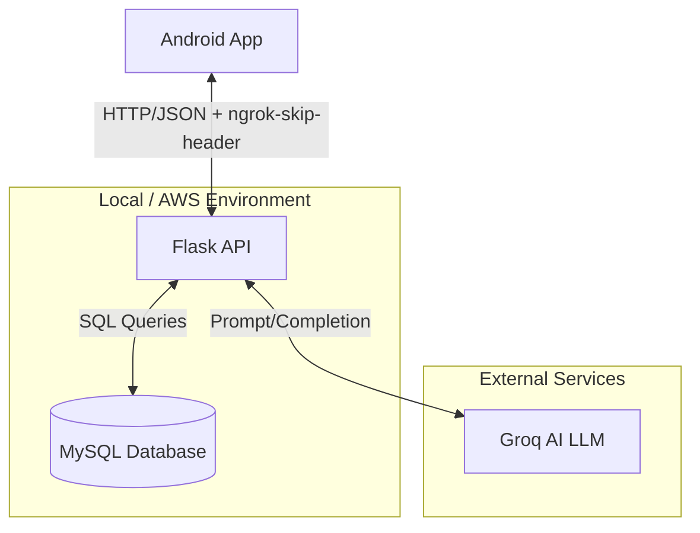
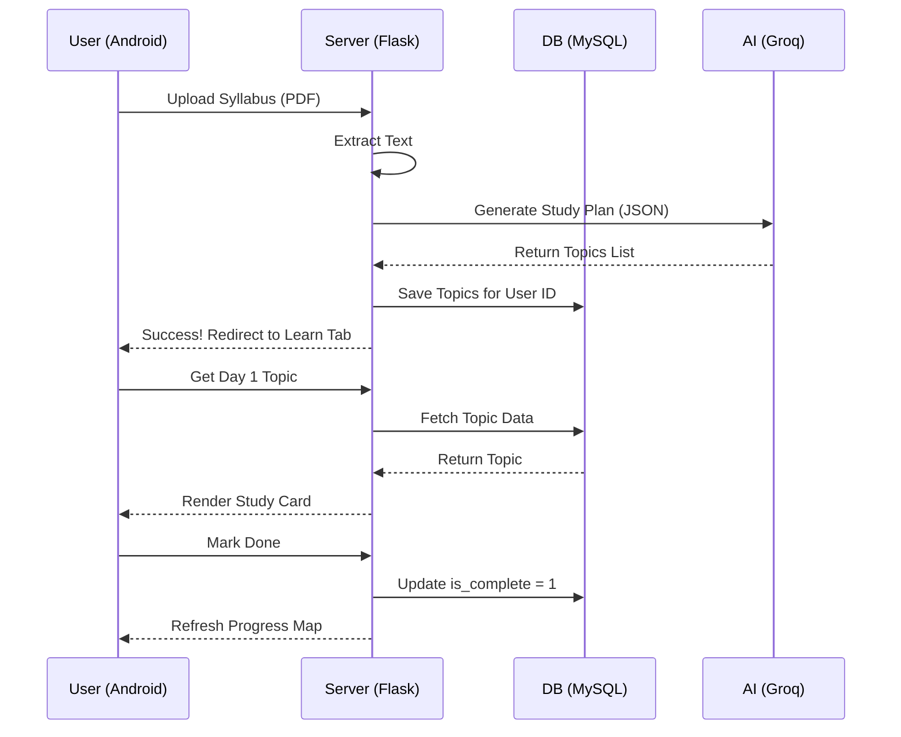

# System Architecture & Data Flow: Daily Learn 📚

This document provides a comprehensive technical overview of the "Daily Learn" application, designed for developers and AI systems to understand the end-to-end logic without missing any details.

## 1. System High-Level Flowchart
This diagram illustrates how the four main components interact.



---

## 2. Detailed Data Flow Nuances

### A. Authentication Flow (The "Handshake")
1. **Request**: Android sends `username` and `password` via POST.
2. **Logic**: Flask hashes the password using `werkzeug.security`.
3. **Storage**: `users` table stores `id`, `username`, and `password_hash`.
4. **Session**: Android stores `user_id` in `SharedPreferences` ("auth") for persistent login.
5. **Nuance**: Every subsequent request from Android must include the `user_id` in the query params or JSON body.

### B. Syllabus Upload & Plan Generation (The "Core")
1. **Input**: Android sends a PDF or Image as a Multi-part POST request.
2. **Parsing**: Flask uses `pdfplumber` (for PDF) or OCR-logic to extract raw text.
3. **AI Processing**: 
   - Flask sends a **System Prompt** to Groq AI (Llama 3.3).
   - The AI is instructed to return a **Strict JSON Array** of topics.
4. **Data Isolation**: Each topic is saved in the `study_plans` table, strictly linked to the `user_id`.
5. **Initial State**: All topics are created with `is_complete = 0`.

### C. The Daily Learning Cycle
1. **Fetch**: Android calls `/todays-topic?user_id=X`.
2. **Dynamic Logic**: Flask calculates the "Current Day" based on the earliest incomplete topic.
3. **AI Enhancement**: If the summary is missing, Flask asks Groq to generate a summary, key points, and formulas for that specific topic on-the-fly.
4. **JSON Structure**:
   ```json
   {
     "day": 1,
     "topic": "Quantum Physics",
     "summary": "...",
     "key_points": ["...", "..."],
     "formulas": ["..."],
     "chat_history": [...]
   }
   ```

### D. AI Doubt-Solving (The "Contextual Chat")
1. **Context**: When a user asks a doubt, Android sends `{user_id, topic, message}`.
2. **Memory**: Flask retrieves previous `chat_history` for that specific topic/user from MySQL.
3. **Prompt Injection**: Flask builds a prompt: `Context: Topic is X. History: [Last 5 msgs]. Question: Y`.
4. **Response**: AI's reply is saved to the `chat_history` table before being sent back to Android.

---

## 3. Database Nuances (Schema)

- **`users`**: Unique index on `username`.
- **`study_plans`**: 
    - Foreign key: `user_id` references `users(id)`.
    - Column `day_index`: Essential for ordering the study sequence.
- **`progress`**: Tracks `completed_at` timestamps for the Heat Map visualization.
- **`chat_history`**: Self-contained per topic; ensures the AI doesn't get confused by unrelated subjects.

---

## 4. Network & Connectivity Nuances

- **Header Bypass**: All Android requests include `"ngrok-skip-browser-warning": "69420"` to avoid the ngrok interstitial page.
- **JSON Safety**: All Kotlin API functions check `response.startsWith("{")` to prevent crashes from non-JSON server errors (e.g., 500 errors).
- **Timeouts**: Android Coroutines use `Dispatchers.IO` for non-blocking network calls, ensuring the UI stays smooth.

## 5. End-to-End Sequence Diagram


